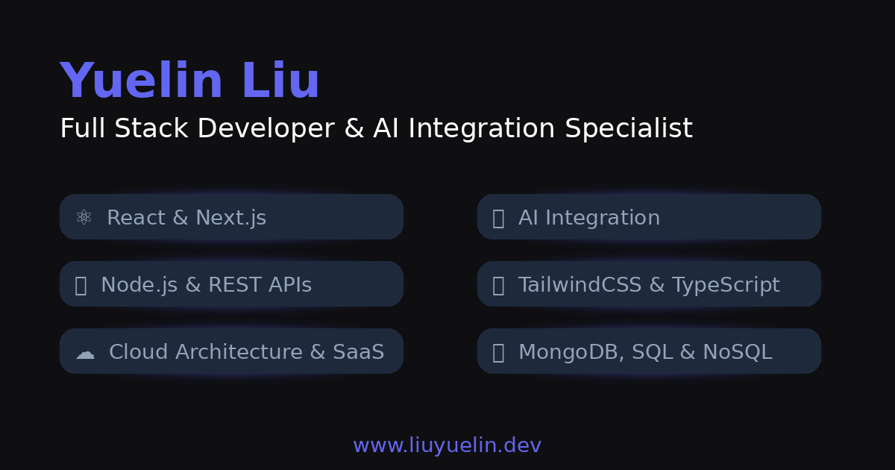

# React Portfolio 🚀

[](https://liuyuelin.dev)
[](https://github.com/liuyuelintop/react-portfolio/stargazers)
[](https://github.com/liuyuelintop/react-portfolio)

---

A **modern, visually stunning, and professionally architected** personal portfolio built with **React 18**, **Tailwind CSS**, and **Framer Motion**. Features comprehensive project showcase, professional experience timeline, interactive skills visualization, and performance-optimized components with enterprise-grade code organization, accessibility enhancements, and unified design system.



---

## 🚦 Lighthouse Performance

| Category       | Desktop | Mobile  |
| -------------- | ------- | ------- |
| Performance    | **100** | **89**  |
| Accessibility  | **100** | **100** |
| Best Practices | **96**  | **96**  |
| SEO            | **100** | **100** |

- **Core Web Vitals:** Excellent scores for CLS, LCP, and FCP
- **Desktop:** Perfect 100 performance with ultra-fast loading
- **Mobile:** Smooth experience with industry-leading optimization
- **Accessibility:** Perfect 100 scores with WCAG AA compliance
- **Modern Standards:** Exceeds accessibility and SEO requirements

> [View Desktop Report](https://pagespeed.web.dev/analysis/https-www-liuyuelin-dev/df2ampev8u?form_factor=desktop) | [View Mobile Report](https://pagespeed.web.dev/analysis/https-www-liuyuelin-dev/df2ampev8u?form_factor=mobile)

---

## ✨ Key Features

### 🎨 **Modern Design & Animations**
- **Hero Section:** Grid layout with animated CTAs, floating geometric shapes, and skills showcase
- **Interactive Navigation:** Active section indicators with smooth scroll animations
- **4-Theme System:** Default, Neon, Minimal, and Corporate themes with system preference detection
- **Advanced Micro-interactions:** Hover effects, loading states, keyboard shortcuts, and toast notifications
- **Unified Typography:** Consistent heading styles across all themes with gradient effects

### 🏗️ **Professional Architecture**
- **Component Organization:** Logical folder structure (`layout/`, `sections/`, `ui/`)
- **Clean Code:** TypeScript-ready with consistent patterns and best practices
- **Performance Optimized:** Code splitting, lazy loading, and optimized bundle size
- **Scalable Structure:** Enterprise-ready organization with error boundaries and accessibility utilities
- **Design System:** Unified typography, accessibility, and theme-aware components

### 💼 **Content Sections**
- **Experience Timeline:** Modern card-based layout with expandable details
- **Project Gallery:** Live demo previews, GitHub integration, and modal details
- **Skills Visualization:** Interactive charts with proficiency levels and project counts
- **Professional References:** Elegant carousel with testimonials and LinkedIn integration
- **Contact Forms:** Professional contact system with project type categorization

### 🚀 **Advanced Features**
- **GitHub Activity:** Real-time activity feed with API integration
- **Live Demo Previews:** Smart project detection with iframe previews
- **Performance Metrics:** Integrated Lighthouse scores with animated displays
- **Accessibility:** WCAG AA compliance with keyboard navigation and screen reader support
- **Toast Notifications:** Theme-aware notification system with multiple types
- **Error Boundaries:** Graceful error handling with user-friendly fallbacks
- **Responsive Design:** Mobile-first approach with perfect cross-device compatibility

---

## 🛠️ Tech Stack

### **Core Technologies**
- [React 18](https://react.dev/) - Modern React with hooks and concurrent features
- [Vite](https://vitejs.dev/) - Fast build tool and development server
- [Tailwind CSS](https://tailwindcss.com/) - Utility-first CSS framework
- [Framer Motion](https://www.framer.com/motion/) - Production-ready motion library

### **Additional Libraries**
- [React Icons](https://react-icons.github.io/react-icons/) - Comprehensive icon library
- [GitHub REST API](https://docs.github.com/en/rest) - Live activity integration
- [Google Drive API](https://developers.google.com/drive) - CV download functionality

### **Development Tools**
- ESLint & Prettier - Code quality and formatting
- Vite Plugin React - Fast refresh and optimized builds
- PostCSS - CSS processing and optimization

---

## 📦 Getting Started

### 1. Clone the Repository
```bash
git clone https://github.com/liuyuelintop/react-portfolio.git
cd react-portfolio
```

### 2. Install Dependencies
```bash
npm install
```

### 3. Environment Configuration
Create a `.env` file in the root directory:
```env
VITE_GOOGLE_FOLDER_ID=your_google_drive_folder_id
VITE_GOOGLE_API_KEY=your_google_api_key
VITE_GITHUB_USERNAME=your_github_username
```

### 4. Development Server
```bash
npm run dev
```
Visit [http://localhost:5173](http://localhost:5173) to see your portfolio.

### 5. Production Build
```bash
npm run build
npm run preview  # Preview production build locally
```

---

## 🏗️ Project Architecture

### **Organized Component Structure**
```
src/
├── components/
│   ├── layout/              # Navigation & layout components
│   │   ├── Navbar/         # Active navigation with scroll detection
│   │   └── FloatingNavigation/
│   ├── sections/           # Main content sections
│   │   ├── Hero/           # Landing section with grid layout
│   │   ├── Experience/     # Professional timeline
│   │   ├── Skills/         # Interactive skills visualization
│   │   ├── Projects/       # Project gallery with live previews
│   │   ├── References/     # Professional testimonials
│   │   ├── Contact/        # Contact forms and information
│   │   ├── PersonalBranding/
│   │   └── GitHubActivity/
│   └── ui/                 # Reusable UI components
│       ├── animations/     # Animation utilities
│       ├── common/         # Shared components (Button, Toast, ErrorBoundary, etc.)
│       └── forms/          # Form components
├── constants/              # Application data and configuration
├── contexts/              # React contexts (theme, etc.)
├── hooks/                 # Custom React hooks
├── utils/                 # Utility functions (accessibility, typography, etc.)
└── assets/               # Static assets and images
```

### **Clean Import Patterns**
```javascript
// Unified component imports
import { Hero, Projects, Experience } from '../components';

// Organized constants
import { HERO_CONTENT, PROJECTS, SKILLS_DATA } from '../constants';

// Custom hooks
import { useTypingAnimation, useScrollAnimation } from '../hooks';
```

---

## 🎯 Development Phases

### **Phase 1-3: Foundation** ✅
- Hero animations and typing effects
- 3D project cards with interactive previews
- Theme system with localStorage persistence

### **Phase 4: Advanced Interactions** ✅
- Live demo previews with smart project detection
- GitHub activity integration
- Professional contact forms
- Scroll-triggered animations

### **Phase 5: Modern Polish** ✅
- Complete Experience section redesign
- Enhanced Project and Reference sections
- Modern Navbar with active indicators
- Hero section grid layout overhaul

### **Phase 6: Code Architecture** ✅
- Comprehensive component restructuring
- Logical folder organization
- Import path optimization
- Documentation and cleanup

### **Phase 7: Portfolio Polish** ✅
- Enhanced accessibility with WCAG AA compliance
- Advanced micro-interactions and toast notifications
- Error boundaries and graceful failure handling
- Unified typography system across all themes
- Keyboard navigation with shortcuts (Alt+H/P/E/S/C)
- Theme-aware focus management and loading states

---

## 📈 Performance Optimizations

### **Loading & Bundle**
- **Code Splitting:** React.lazy() for route-level splitting
- **Tree Shaking:** Optimized imports and unused code elimination
- **Asset Optimization:** WebP images and lazy loading
- **Bundle Analysis:** Minimal dependencies and optimized chunks

### **Runtime Performance**
- **Memoization:** React.memo and useMemo for expensive operations
- **Efficient Animations:** Framer Motion with transform optimizations
- **Scroll Performance:** Intersection Observer for scroll-based animations
- **State Management:** Optimized context usage and local state

---

## 🔧 Customization Guide

### **Adding New Sections**
1. Create component in `src/components/sections/YourSection/`
2. Add data constants in `src/constants/yourSection.js`
3. Import and add to `src/App.jsx`
4. Update navigation in `SECTION_LINKS`

### **Modifying Content**
- **Personal Info:** Update `src/constants/constants.js`
- **Projects:** Modify `src/constants/projects.js`
- **Experience:** Edit `src/constants/experiences.js`
- **Skills:** Update `src/constants/skills.js`

### **Theme Customization**
- **Colors:** Modify theme definitions in `src/contexts/ThemeContext.jsx`
- **Styling:** Update Tailwind configuration in `tailwind.config.js`
- **Animations:** Customize motion variants in component animation files

---

## 📋 Scripts

```bash
npm run dev          # Start development server
npm run build        # Build for production
npm run preview      # Preview production build
npm run lint         # Run ESLint
npm run lint:fix     # Fix ESLint issues
```

---

## 🤝 Contributing

### **Development Workflow**
1. Fork the repository
2. Create a feature branch: `git checkout -b feature/your-feature`
3. Follow the existing component structure and patterns
4. Ensure all imports use the organized folder structure
5. Test your changes with `npm run build`
6. Commit with clear messages: `git commit -m "feat: add your feature"`
7. Push and create a Pull Request

### **Code Standards**
- Follow the established folder organization
- Use TypeScript-compatible patterns
- Maintain component documentation
- Ensure responsive design
- Test across different themes

---

## 📚 Documentation

Comprehensive development documentation is available in the `docs/claude-development/` folder:

- **[Project Structure Guide](./docs/claude-development/PROJECT_STRUCTURE.md)** - Complete architecture overview
- **[Development Logs](./docs/claude-development/)** - Detailed daily progress and phase implementations
- **[Claude Integration](./docs/claude-development/CLAUDE.md)** - AI-assisted development setup

---

## 📄 License

[MIT License](LICENSE) - Feel free to use this project for your own portfolio!

---

## 👨‍💻 Author

**Yuelin Liu** - Full Stack Developer & AI Engineer

[](https://linkedin.com/in/liuyuelintop)
[](https://github.com/liuyuelintop)
[](https://blog.liuyuelin.dev/)

---

## ⭐ Support

If this project helped you create an amazing portfolio, please:

1. ⭐ **Star this repository**
2. 🍴 **Fork it for your own use**
3. 📢 **Share it with others**
4. 🐛 **Report any issues**

> **Built with ❤️ using React, Tailwind CSS, and Claude Code assistance**