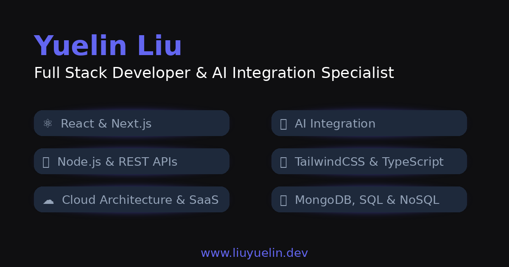

# React Portfolio

[](https://liuyuelin.dev)
[](https://react.dev/)
[](https://vitejs.dev/)
[](https://tailwindcss.com/)

A content-driven portfolio for Yuelin Liu. It is built to present recruiter-facing proof clearly: positioning, working style, experience, skills, selected case studies, contact paths, and a reliable static resume download.

The repo is also intended to be useful as an open-source reference for a modern React/Vite portfolio that stays maintainable without becoming a framework.



## What This Project Optimizes For

- Clear hiring narrative instead of a generic project gallery.
- Data-driven content in `src/constants/`, so copy and portfolio data can change without rewriting components.
- Small, composable React sections with lazy loading and section-level error boundaries.
- Theme-aware UI across Default, Neon, Minimal, and Corporate themes.
- Accessible navigation, skip link, focus states, and keyboard shortcuts.
- Reliable resume delivery through a static PDF, not a client-side API lookup.
- A dependency set that reflects the current app rather than historical experiments.

## Live Sections

The rendered page is intentionally focused:

1. Hero
2. Career Snapshot
3. Working Style
4. Experience
5. Skills
6. Projects
7. Contact

Older unmounted sections were removed during cleanup. If a Blog, Chatbot, References, or GitHub activity feed comes back later, it should be reintroduced as a deliberate live feature with current content, mounted app wiring, and justified dependencies.

## Tech Stack

- React 18 with function components and hooks
- Vite 5
- Tailwind CSS 3
- Framer Motion
- lucide-react and react-icons
- prop-types for runtime prop validation
- ESLint with React, hooks, and Fast Refresh rules

## Project Structure

```text
src/
├── components/
│   ├── layout/      # Navbar
│   ├── sections/    # Live page sections
│   └── ui/          # Shared UI components and animation helpers
├── constants/       # Page content, project data, skills, experience
├── contexts/        # Theme and UI providers
├── hooks/           # Custom hooks
├── utils/           # Accessibility and typography helpers
└── assets/          # Bundled image assets
public/
└── resume/          # Static resume PDF served by Vite
```

## Content Model

Most portfolio edits should start in `src/constants/`:

- Hero, contact, career snapshot, working style: `src/constants/constants.js`
- Experience: `src/constants/experiences.js`
- Projects: `src/constants/projects.js`
- Skills: `src/constants/skills.js`
- Technology icons/groups: `src/constants/technologies.js`

Components should stay mostly presentational. They map over structured data, apply theme-aware styling, and handle local interaction only where needed.

## Resume Handling

The resume CTA links to:

```text
public/resume/yuelin-liu-resume.pdf
```

This is a deliberate choice. A static PDF is more reliable for a recruiter-facing CTA than a Google Drive API lookup because it avoids exposed API configuration, Drive permission drift, quota issues, client-side loading states, and dev/prod behavior differences.

To update the resume, replace the PDF at the same path. If the filename changes, update `HERO_CONTENT.resumeUrl` in `src/constants/constants.js`.

## Project Preview Strategy

Project cards open a modal with overview, features, tech stack, and an optional live preview. The preview component now keeps a narrow responsibility:

- show an embedded live preview when a project has a URL;
- provide a direct "Open Project" link for hosts that block iframe embedding;
- avoid old fallback flows for project types that are no longer part of the current portfolio.

This keeps the modal useful without carrying stale logic for auth demos, chatbot embeds, extension install guides, or placeholder videos.

## Development

Install dependencies:

```bash
npm install
```

Run the dev server:

```bash
npm run dev
```

Build for production:

```bash
npm run build
```

Preview the production build:

```bash
npm run preview
```

Run lint:

```bash
npm run lint
```

## Quality Gates

Before shipping changes, run:

```bash
npm run lint
npm run build
```

There are no unit tests in this repo. For UI changes, also do a manual pass in `npm run dev`, especially around the hero CTA, project modal, theme behavior, mobile navigation, and contact form.

## Keyboard Shortcuts

- `Alt + H`: Hero
- `Alt + W`: Working Style
- `Alt + E`: Experience
- `Alt + S`: Skills
- `Alt + P`: Projects
- `Alt + C`: Contact
- `Alt + ?`: Help toast

## Customization Guide

To adapt this portfolio for another person:

1. Replace personal copy in `src/constants/constants.js`.
2. Replace experience data in `src/constants/experiences.js`.
3. Replace projects and project images in `src/constants/projects.js` and `src/assets/projects/`.
4. Replace the resume PDF in `public/resume/`.
5. Review theme behavior in `src/contexts/ThemeContext.jsx`.
6. Run `npm run lint` and `npm run build`.

Avoid hardcoding portfolio copy directly inside components unless it is true UI text rather than content.

## Adding A New Section

1. Create the section under `src/components/sections/YourSection/`.
2. Put content data in `src/constants/`.
3. Lazy-load the section in `src/App.jsx`.
4. Wrap it in `ErrorBoundary`, matching the existing pattern.
5. Add navigation only if the section is mounted and has a stable `id`.
6. Update this README and `AGENTS.md` if the app surface changes.

## Environment Variables

The current live portfolio does not require environment variables for the resume link or core page rendering. If a future feature needs configuration, use Vite's `VITE_` prefix and document the variable here.

```env
# Example only:
# VITE_SOME_PUBLIC_CONFIG=
```

Do not commit secrets.

## Contributing

This is a personal portfolio, so changes should preserve the hiring narrative and avoid speculative feature work. Useful contributions usually fall into one of these categories:

- accessibility fixes;
- performance improvements;
- clearer content structure;
- theme consistency fixes;
- dependency or build hygiene;
- small UI improvements that support the current live sections.

Before opening a pull request, include the commands you ran and any manual browser checks you performed.

## License

This repository is shared as a portfolio reference. If you adapt it, replace personal content, project data, images, resume files, and contact details with your own.
